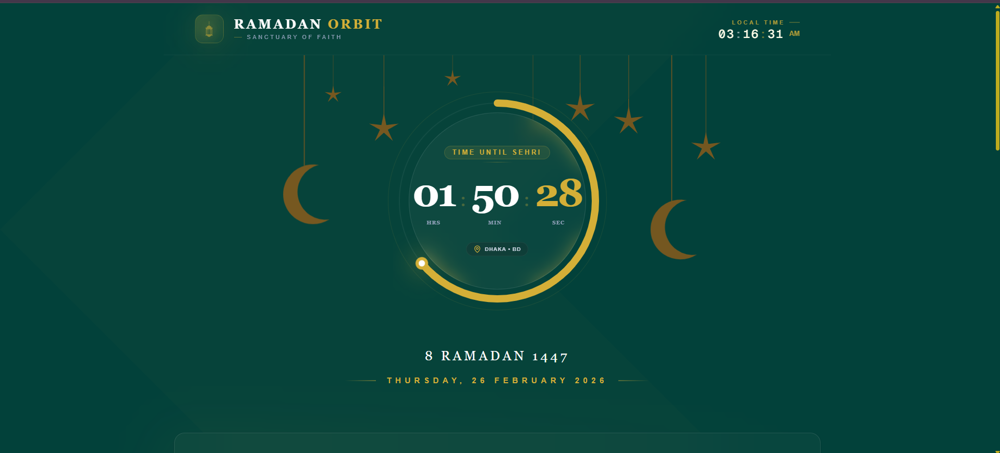
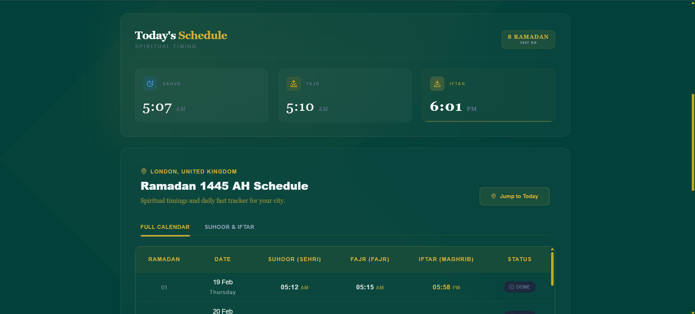
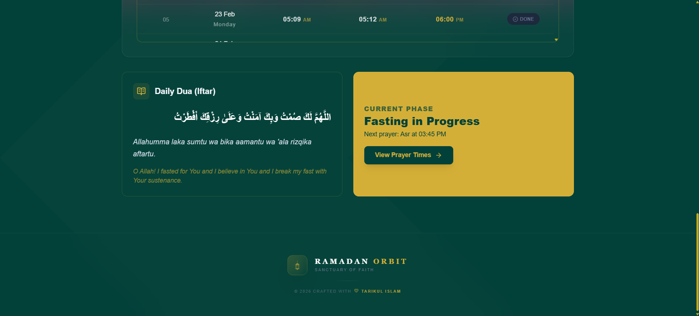
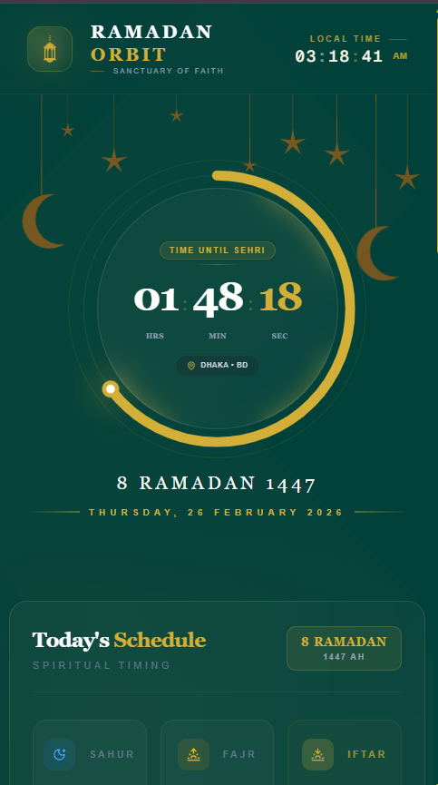

# 🌙 Ramadan Orbit

[Live Demo](https://ramadan-orbit.vercel.app)

Ramadan Orbit is a web app designed to enhance your Ramadan experience by providing **Sehri, Iftar, and Fajr timings** for all **64 districts of Bangladesh**, based on the official guidelines from the **Islamic Foundation of Bangladesh**. The app automatically detects your location and shows the Ramadan calendar tailored for your area.

---

## ✨ Key Features

- **Auto Location Detection** – Instantly get your local timings.
- **Full Ramadan Calendar** – Plan your month effectively.
- **Mobile-Friendly & Full-Screen View** – Check timings on the go.
- **Clean, Smooth UI** – Easy navigation and interactions.

---

## 🖼️ Screenshots

| Screenshot 1 | Screenshot 2 |
|--------------|--------------|
|  |  |

| Screenshot 3 | Screenshot 4 |
|--------------|--------------|
|  |  |

---

## 🛠️ Tech Stack

- **Frontend:** React, Next.js  
- **Styling:** Tailwind CSS  
- **Animation:** Framer Motion  
- **Icons:** Lucide React  

---

## 🚀 Live Demo

Check it live here: [https://ramadan-orbit.vercel.app](https://ramadan-orbit.vercel.app)

---

## 🙏 Contribution

Feel free to fork the project, submit issues, or create pull requests to improve the app.  
This project is open-source and aims to help the community make Ramadan more organized and spiritually fulfilling.
